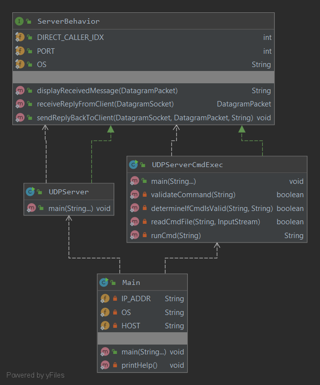

# udp-server
UDP Server to receive messages and commands from a UDP Client

May be invoked by a UDP client like this: https://github.com/bss8/udp-client

Note: This project intentionally forgoes the convenience of using a build system like Maven 
or Gradle and instead opts for manual configuration. The intent is to practice and understand 
how Java is built and the convenience such systems offer. If building locally, you will 
need to add JUnit 5.4 to your classpath if you wish to run unit tests. Otherwise, remove those 
classes. 

### Class Diagram 

## To Build
#####Windows: 
`cd scripts`    
`build.bat`

#####Linux: 
`cd scripts`    
`./build.sh`

## To Run
Prerequisite: build the application. 
#####Windows: 
`cd scripts`    
`run.bat`

#####Linux: 
`cd scripts`    
`./run.sh`

### Helpful Links
1. [Custom manifest for JAR](https://stackoverflow.com/questions/20156714/jar-ignores-my-manifest)
###### NTP Specific: 
2. [Building a more accurate time service at Facebook scale](https://engineering.fb.com/production-engineering/ntp-service/)
3. [IETF NTP](https://tools.ietf.org/html/rfc958)
4. [Clock(Time) synchronization — Part 2](https://medium.com/@looxid.labs/clock-time-synchronization-2-a9f6f24c3ae3)
5. [Using NTP to understand Internet Latency](https://cs.colgate.edu/~jsommers/pubs/ntp_hotnets15.pdf)